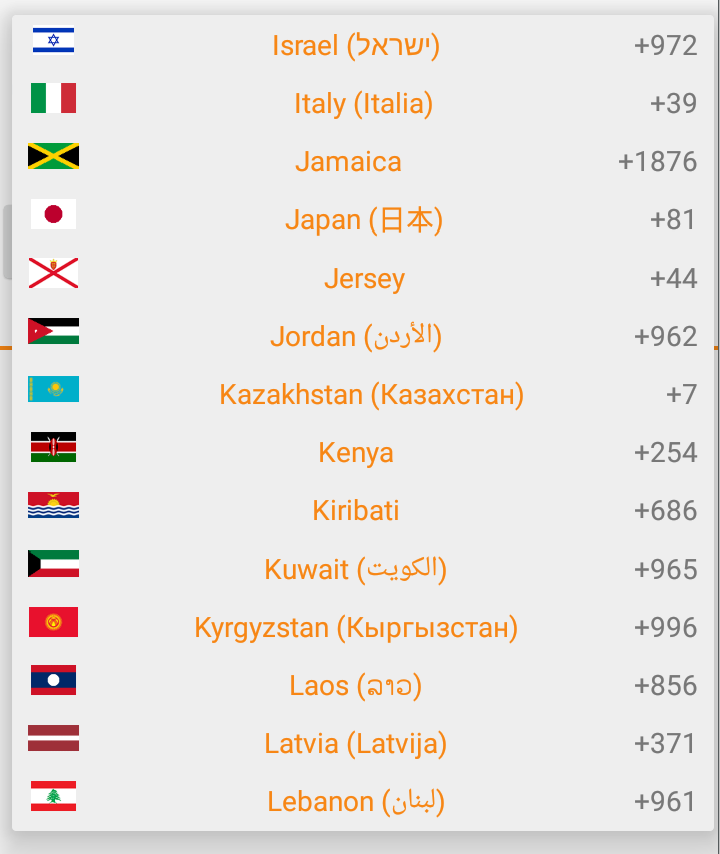

# International Phone Input #

## What is it?
**IntlNumberInput** is a custom view for Android that allows the user to enter his phone number in an
elegant and friendly way.It adds a flag dropdown to any input, automatically detects the user's
country, displays a relevant placeholder and auto formats the number as they type.

## Features
1. Automatically format the number as the user types
2. Automatically set the input placeholder to an example number for the selected country
3. Selecting a country from the dropdown will update the dial code in the input
4. Typing a different dial code will automatically update the displayed flag
5. Easy embedding as a Custom View
6. Listeners available to detect validity change
7. Automatically detect phone number when information available

## Getting started

## Attributions

1. Inspired by [intl-tel-input for jQuery](https://github.com/jackocnr/intl-tel-input)
2. Flag images from [region-flags](https://github.com/behdad/region-flags)
3. Original country data from mledoze's [World countries in JSON, CSV and XML](https://github.com/mledoze/countries)
4. Formatting/validation/example number code from [libphonenumber](https://github.com/googlei18n/libphonenumber)